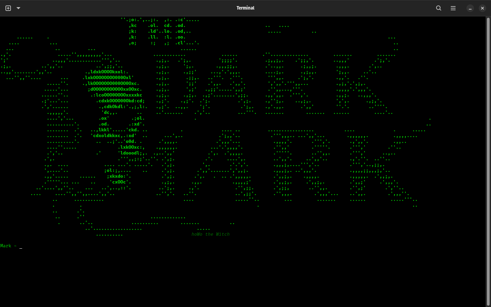
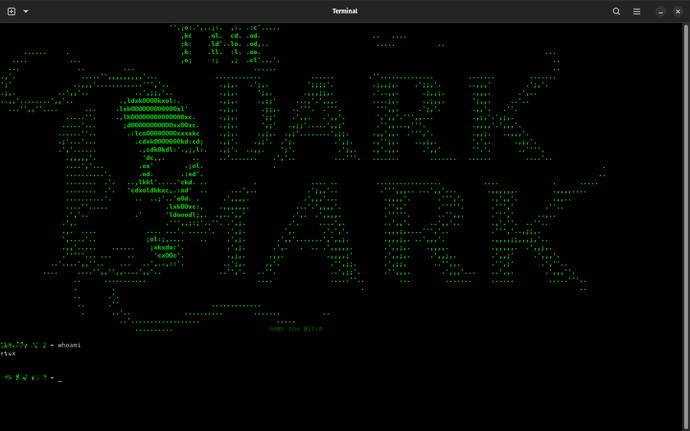
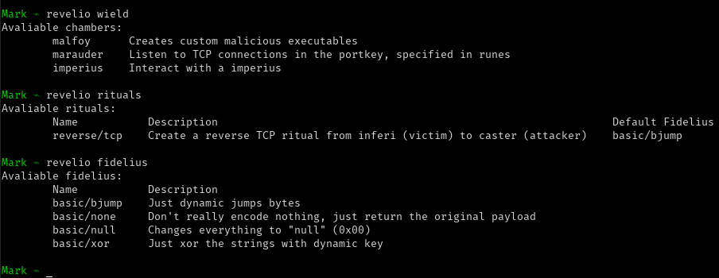

<p align="center">
  <a href="https://github.com/Yyax13/TheDarkMark.git" rel="noopener">
 </a>
</p>

<h1 align="center" style="font-size: 45px;">The Dark Mark</h1>
<div align="center">


[](/LICENSE)

</div>

---

<p align="center">The Dark Mark is a C2 framework designed for efficient command and control operations in cybersecurity contexts.
    <br> 
</p>

## 📝 Table of Contents

- [About](#about)
- [Getting Started](#getting_started)
- [Spoilers](#spoilers)
- [Deployment](#deployment)
- [Usage](#usage)
- [Built Using](#built_using)
- [TODO](TODO.md)
- [Contributors](CONTRIBUTORS.md)
- [Authors](#authors)

## 🧐 About <a name = "about"></a>

The Dark Mark framework is designed to provide a comprehensive solution for command and control operations in cybersecurity. It allows users to manage multiple clients, execute commands in real-time, and maintain secure communication channels. The framework is built with scalability and ease of use in mind, making it suitable for both small-scale and large-scale deployments. You can quickly set up a server, connect clients, and start executing commands without extensive configuration. The framework also includes features for monitoring client activity, managing sessions, and ensuring secure data transmission, making it a versatile tool for cybersecurity professionals and researchers alike. Don't be scared to explore its capabilities and customize it to fit your specific needs in command and control operations.

## 🏁 Getting Started <a name = "getting_started"></a>

Hello user, in this section, we will guide you through the process of setting up The Dark Mark framework on your local machine for development and testing purposes. Follow these steps to get started:

Clone our repository and make sure you have the necessary dependencies installed (check the [Prerequisites](#prerequisites)).

```bash
git clone https://github.com/Yyax13/TheDarkMark.git
cd TheDarkMark
```

And run the make command to build the project:

```bash
make build
```

The make command will compile based in your operating system and architecture, creating the necessary binaries in the `build/` directory.
If you use windows, the executable can be triggered by some AVs, but it is normal, as it is a C2 framework, so it will be detected by AVs/EDRs.

### Prerequisites <a name = "prerequisites"></a>

What things you need to install the software and how to install them.

- Golang 1.22.2 or higher
- Make sure you have the necessary permissions to run scripts on your system.
- Running the framework in a terminal with TERM and support for ANSI escape codes is recommended for better output formatting.
- Chocolatey (for Windows users), we use it to install go if you haven't it - You can install it from [here](https://chocolatey.org/install).

## 🕵️‍♂️ Spoilers <a name = "spoilers"></a>





## 🎈 Usage <a name="usage"></a>

In the framework, you can use the following commands to interact with the server and clients:

- `wield`: Use a specific module.
- `enchant`: Set options for the current module.
- `runes`: View and manage options for the current module.
- `cast`: Execute the current module with the specified options.
- `scourgify`: Clears the terminal screen and print banner.
- `finite`: Exits the framework.
- `revelio`: Lists anything usable in the framework, such as modules, sessions, and anything other.
- `grimorie`: Displays a list of avaliable commands for listing.
- `pensieve`: Displays the list of available commands.

## 🚀 Deployment <a name = "deployment"></a>

We haven't deployed the framework yet, but you can run it locally by following the [Getting Started](#getting_started) section.

Stay tuned for updates on deployment options, including cloud-based solutions and containerized deployments.

## ✍️ Authors <a name = "authors"></a>

- [@hoWo](https://github.com/Yyax13) - Idea & Initial work

See also the list of [contributors](https://github.com/Yyax13/TheDarkMark/contributors) who participated in this project.
